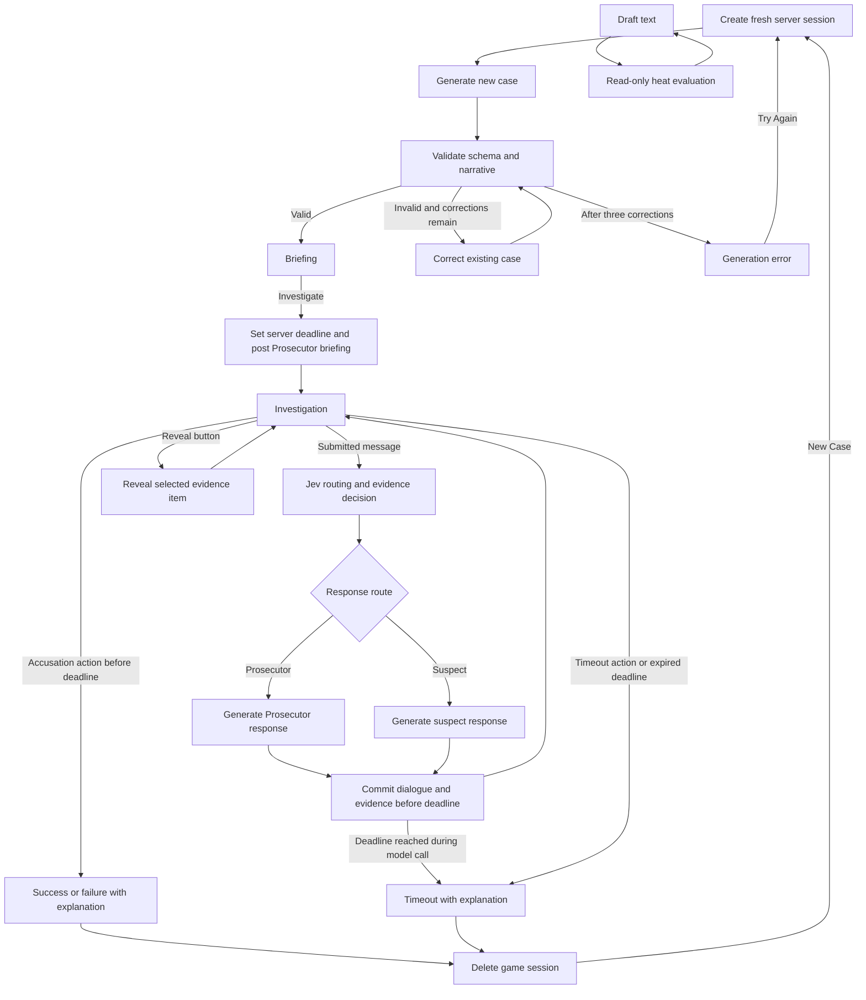

# PRD — AI Detective: Dynamic Case Investigation

**Status:** Initial product baseline  
**Product language:** English  
**Persistence:** No durable persistence. The app creates a fresh game on page load or New Case. Active game state exists only in server memory and is deleted on terminal state or inactivity expiry; closing a tab triggers best-effort cleanup through CopilotKit, with inactivity expiry as a fallback.

## 1. Product overview

AI Detective is a web-based investigation game in which a player has ten minutes to solve a dynamically generated homicide or robbery. Each game contains one coherent, self-contained case with three suspects, three initially hidden evidence items, one perpetrator, and one valid solution.

The player investigates through chat. They interrogate one suspect at a time, ask a Prosecutor for contextual facts, discover evidence by referring to relevant details, and accuse any suspect whenever they choose. The game records all statements but does not identify contradictions for the player.

### Product goals

- Deliver a fresh, coherent mystery on every game.
- Make cases solvable through evidence, dialogue, and player reasoning.
- Keep the player-facing experience simple: chat, suspects, evidence, timer, and accusation.
- Use fast structured AI decisions for routing and evidence logic, while reserving generative models for narrative content.
- Keep every player-facing string in English.

### Success criteria

- A player can start a valid new game without knowing the hidden solution.
- Every case has exactly one evidence-supported perpetrator.
- The player can discover evidence through natural language without selecting a predefined clue.
- An incorrect accusation or time expiration ends the game; a correct accusation explains the case.

## 2. Scope

### In scope

- Generated **homicide** and **robbery** cases.
- Exactly three suspects, three evidence items, and one perpetrator per case.
- Ten-minute, non-pausable investigation timer.
- Chat-based suspect interrogation and Prosecutor context responses.
- Evidence discovery from submitted player text.
- A live hot/cold relevance meter for draft text.
- Direct suspect selection and accusation controls.
- Structured generation validation with up to three corrections of the same case.
- In-memory state for the active browser session only.

### Out of scope

- Saving, resuming, or sharing in-progress games.
- More than three suspects or evidence items.
- Explicitly labeling contradictions or coaching the player toward the answer.
- Portraits or generated imagery for suspects.
- Multiple perpetrators, alternate solutions, partial victory, or a second accusation.

## 3. Functional requirements

### 3.1 Case generation and validation

1. A new browser session must create a new case before its briefing screen is shown.
2. The app shows **“Preparing a new case…”** while a case is generated and validated.
3. A generation attempt must produce a structured case object that passes schema validation and narrative validation.
4. If schema, case invariants, or narrative validation finds a material issue, the system corrects the existing case using the reviewer's feedback and validates it again.
5. The system may make up to three correction rounds before returning an error.
6. If generation or correction fails, the app shows an error state with **“Try Again”**, which begins a fresh generation cycle.

### 3.2 Briefing and game start

1. The briefing screen displays the crime type, short synopsis, a three-to-four-sentence incident report, and an **“Investigate”** button. The report explains what happened, where and when it was discovered, and what was harmed or stolen. It contains no suspect names or alibis.
2. The countdown does not run on the briefing screen.
3. Selecting Investigate begins the ten-minute countdown and opens the investigation view.
4. On entering the investigation, the Prosecutor posts the incident report again and does not introduce suspects or their alibis.
5. Selecting a suspect starts that interview and presents that person's public alibi as their own statement.
6. The Prosecutor must not imply that any stated alibi is true, false, suspicious, or trustworthy.

### 3.3 Investigation

1. The player can send questions, observations, theories, or statements with no per-game message limit.
2. The timer is the only gameplay limit and cannot be paused.
3. One suspect is active at a time.
4. The player can change the active suspect by selecting that suspect in the UI or asking to speak with them in chat.
5. Changing suspects adds a visual chat divider and a short entry message from the selected suspect. That entry affirms innocence and may refer to the suspect’s public alibi. It must not automatically refer to discovered evidence.
6. The full conversation must remain visible and scrollable until the game ends.

### 3.4 Prosecutor behavior

1. The Prosecutor handles contextual questions, including explicit requests such as “Prosecutor, tell me about Marcos.”
2. The routing system may send an unaddressed contextual question to the Prosecutor.
3. The Prosecutor can provide facts that are explicitly present in the canonical case.
4. If the case does not establish an answer, the Prosecutor returns a short natural English variation of: **“We can’t confirm that from the available information.”**
5. The Prosecutor must not suggest leads, reveal hidden evidence, name the perpetrator, assess credibility, or call out contradictions.

### 3.5 Evidence discovery

1. A case contains exactly three evidence items.
2. The player begins with three visible placeholder slots, each labeled **`❓ Unknown evidence`**.
3. An evidence item unlocks only after the player submits text that meaningfully refers to it and the decision system confirms the match.
4. Draft text and the hot/cold meter must never unlock evidence.
5. Unlocking replaces the relevant placeholder with the evidence emoji, name, and description; it also triggers a short reveal animation and a short notification such as **“New evidence discovered: 🍵 Broken teacup.”**
6. Descriptions may include useful observations, including non-conclusive interpretive detail, but must not explicitly identify the perpetrator.
7. Each hidden evidence slot has a **“Reveal”** button. Selecting it reveals only that item and does not reveal the solution.

### 3.6 Hot/cold meter

1. The UI includes a vertical relevance meter with an ice icon at the cold end, a fire icon at the hot end, and a blue-to-orange gradient.
2. The meter evaluates all draft input: questions, claims, and theories.
3. Its value combines relevance to hidden or discovered evidence and relevance to the actual solution.
4. It is neutral when the composer is empty and immediately after a submitted message.
5. Draft evaluation must be debounced and stale responses must not overwrite a more recent draft value.
6. The meter is advisory. It does not disclose the reason for its value or alter game state.

### 3.7 Accusation and terminal states

1. Each suspect card has an **“Accuse”** button.
2. The player may accuse any suspect at any time, regardless of evidence discovered.
3. Clicking Accuse opens a confirmation dialog, for example: **“Accuse Marcos? This will end the investigation.”**
4. Confirming a correct accusation ends the game in a **“Success”** state.
5. Confirming an incorrect accusation ends the game in a failure state and identifies the person accused.
6. Timer expiration ends the game in a **“Timeout”** failure state.
7. Every terminal state displays the pre-generated case explanation and a **“New Case”** button.
8. New Case discards the current game and begins generation of a new case.
9. A separate **“Display solution”** debug control can show the culprit, method, and explanation during an active game without ending it. It is distinct from the per-clue **“Reveal”** controls.

## 4. Canonical case contract

The generator returns structured JSON. The implementation may add fields, but it must satisfy this contract.

```ts
type CrimeType = "homicide" | "robbery";
type SuspectId = "suspect_1" | "suspect_2" | "suspect_3";
type EvidenceId = "evidence_1" | "evidence_2" | "evidence_3";

type GeneratedCase = {
  caseId: string;
  crimeType: CrimeType;
  shortSynopsis: string;
  incidentBriefing: string;
  fullCase: string;
  timeline: Array<{ time: string; event: string }>;
  suspects: Array<{
    id: SuspectId;
    name: string;
    emoji: string;
    publicAlibi: string;
    privateKnowledge: string[];
    behavior: string;
    isPerpetrator: boolean;
  }>;
  evidence: Array<{
    id: EvidenceId;
    emoji: string;
    name: string;
    description: string;
    unlockTriggers: string[];
    solutionRelevance: string;
  }>;
  solution: {
    perpetratorId: SuspectId;
    method: string;
    motive: string;
    alibiFlaws: string[];
    reasoning: string;
    playerFacingExplanation: string;
  };
};
```

### Case invariants

- There are exactly three suspects, three evidence items, and one perpetrator.
- Each suspect has a name, emoji, public alibi, and scoped private knowledge.
- Each evidence item has an emoji, concise English name and description, semantic trigger phrases, and a link to the solution.
- The timeline, evidence, method, motive, and dialogue constraints support one unique conclusion.
- Only the perpetrator has material falsehoods in their alibi. Those flaws are subtle and linked to evidence.
- Innocent suspects may lack information, but their public alibis are canonically true.
- The short synopsis and incident briefing must not disclose the solution or suspect alibis.
- `playerFacingExplanation` is generated at case creation, stored in the case, and reused unchanged at game completion.

## 5. AI and graph responsibilities

### Jev: structured real-time decisions

Jev does not write dialogue. It returns structured decisions for submitted messages and a temporary heat value for draft input.

For submitted input, it determines:

- Whether the Prosecutor or active suspect should respond.
- Whether the player explicitly requests the Prosecutor.
- Whether the player requests another suspect, and the valid target ID.
- Which currently hidden evidence IDs, if any, should unlock.

The dialogue model receives only alibis the player has already heard by selecting those suspects. Selecting one suspect does not disclose the others' accounts.

For drafts, it returns only a continuous heat value. No draft evaluation may affect state.

### Generative LLM: case content and dialogue

The generative LLM:

- Generates cases in the structured contract.
- Performs a second-pass narrative validation of generated cases.
- Writes the Prosecutor and suspect dialogue after routing has been decided.

It always receives the canonical case context and the relevant speaker constraints. This secret context is never presented directly to the player.

### Dialogue constraints

- Innocent suspects speak only from their scoped knowledge and say they do not know when appropriate.
- The perpetrator can deny, omit, minimize, or distort established facts.
- The perpetrator cannot invent people, objects, events, or evidence that do not exist in the canonical case.
- When confronted with a contradiction, the perpetrator deflects or reframes their account; they do not confess before a correct accusation is confirmed.
- Dialogue must not refer to evidence as a game mechanic or call it “unlocked.”

### LangGraph

A Node.js Fastify API owns a per-session registry, and LangGraph.js owns state transitions for each game action. The graph orchestrates routing, evidence updates and reveals, dialogue, deadline checks, accusations, and end states. The server owns the authoritative deadline; the browser renders the countdown and submits a timeout action when it reaches zero. Every game action checks the deadline, and in-flight model calls are cancelled at that deadline, so a delayed or forged browser timer cannot extend an investigation. The graph does not run continuously while idle.

The canonical case, private knowledge, hidden evidence, and solution stay in Fastify's in-memory session map. Standard game responses use explicit public projections. The explicit CopilotKit `solution` command (also available through the compatibility `GET /game/solution` route) returns the solution during an active game without changing its state. Bind each game to a server-issued, unguessable HttpOnly cookie; never accept a client-supplied session ID. Serialize actions per session so overlapping requests cannot overwrite one another. Create a fresh session on New Case, remove it on terminal state or the CopilotKit `close` command, and apply an inactivity TTL to abandoned sessions.

Draft heat evaluation is a separate read-only operation. It may read the active case context but must not mutate game state. The caller supplies a version so the client can discard stale results.



## 6. Architecture and technical requirements

### Stack

- Next.js App Router, TypeScript, Tailwind CSS, and Motion for simple animations.
- CopilotKit headless hooks and a same-origin Next.js runtime connected to Fastify over AG-UI for all interface actions.
- Node.js with Fastify, TypeScript, and LangGraph.js for the API and game state transitions.
- `@typesafe-ai/sdk` for Jev decisions about message routing, evidence discovery, and relevance scoring.
- OpenAI for case generation, validation, and suspect dialogue.
- Pino for API and model progress logs (`LOG_LEVEL=info` by default).

### Environment variables

```dotenv
TYPESAFE_API_KEY=
TYPESAFE_MODEL=jev-latest
OPENAI_API_KEY=
OPENAI_GENERATION_MODEL=gpt-6-luna
OPENAI_MODEL=gpt-6.1-sol
```

### Reliability requirements

- Validate generated JSON and all model-returned IDs before applying state changes.
- Reject evidence and suspect IDs that do not belong to the active case.
- Ignore stale asynchronous heat responses.
- Prevent game actions once a terminal state is reached.
- Do not persist game state beyond the active session.
- Keep canonical case data in the backend session map and return an explicit public projection.
- Serialize actions per session; remove terminal sessions and apply an inactivity TTL as a fallback.
- Treat the server deadline as authoritative; the browser countdown is display-only and must submit an expiration action.
- Keep the Fastify API behind the same-origin CopilotKit runtime; `/api/copilotkit` is the public browser boundary.

## 7. Acceptance criteria

1. A valid fresh case is shown, or an actionable error appears when generation fails or the same case remains invalid after three corrections.
2. Investigate starts the timer and posts the Prosecutor briefing; the briefing screen itself does not consume time.
3. The active view includes three suspects, three unknown evidence slots, a timer, chat, a composer, and the hot/cold meter.
4. Relevant submitted text unlocks the correct evidence; typing alone cannot unlock it.
5. Chat messages visibly identify Detective, Prosecutor, and the relevant suspect.
6. The Prosecutor answers supported context without revealing hidden evidence or implying guilt.
7. Suspect dialogue adheres to scoped knowledge and perpetrator deception rules.
8. Correct, incorrect, and timeout endings display the stored case explanation.
9. Refreshing the app always discards the case and starts a new one.
