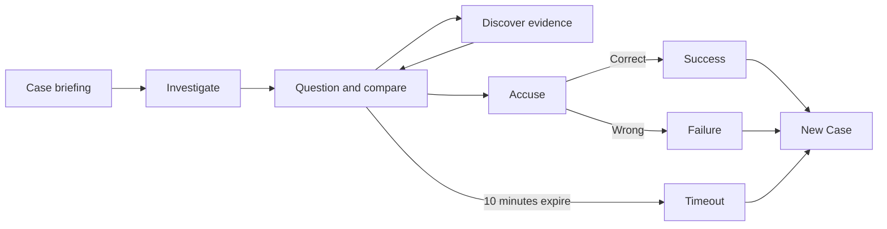
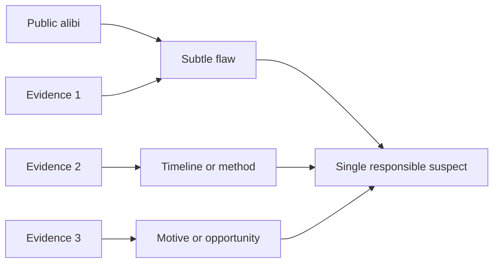

# Game Design Document — AI Detective

**Working title:** AI Detective  
**Genre:** Real-time conversational mystery  
**Supported case types:** Homicide and robbery  
**Player-facing language:** English

## 1. Design intent

AI Detective is built around the feeling of sitting in an interrogation room with incomplete information. The player should notice a detail, test it through questions, compare statements in the chat, and decide when the evidence is strong enough to accuse someone.

The game must not solve the mystery for the player. It should provide enough information to reason from, then stay quiet about the meaning of that information. A suspicious answer, a mismatch in timing, or an oddly worded alibi are materials for deduction, not system-generated conclusions.

### Player fantasy

> “I caught the inconsistency myself.”

### Design pillars

1. **Reasoning over guessing.** Every winning conclusion must follow from the generated story, evidence, and statements.
2. **Conversation is investigation.** The player discovers evidence and tests theories through natural language, not through a checklist of actions.
3. **Pressure without obstruction.** Ten minutes create urgency, while unlimited messages allow the player to think and investigate freely.
4. **Mystery stays mysterious.** The system can guide a player through temperature and discovered evidence, but never labels a contradiction or suggests who is guilty.
5. **Coherent performances.** Each character speaks from what they know; the perpetrator protects their story without breaking the case’s facts.

## 2. Session structure

### 2.1 Briefing

Each new session begins with a crime-focused incident report and an **“Investigate”** button. It states what happened, where and when it was discovered, and what was harmed or stolen. It does not give suspect alibis; those are heard during each interview. This is the player’s only pause before the clock begins.

Selecting Investigate starts the ten-minute timer and moves into the interrogation room. The Prosecutor repeats the incident report without listing suspects or alibis. Selecting a suspect begins the interview and lets the player hear that person's public account. After an interview, the Prosecutor may repeat an alibi as an attributed claim, for example: “Marcos states that he arrived at 8:15 PM.” The Prosecutor does not endorse the statement, question it, or hint that there is a contradiction.

### 2.2 Investigation

The player is the **Detective**. They can:

- Ask the active suspect direct questions.
- State theories or observations.
- Ask for a different suspect by name.
- Click a suspect card to switch the interview.
- Address the Prosecutor directly for contextual information.
- Accuse any suspect at any moment.

The player can ask as many questions as they want. The clock, rather than a turn allowance, drives pacing.

### 2.3 Case resolution

Accusation is a deliberate commitment. The player selects **“Accuse”** below any suspect, confirms the decision, and ends the session.

There are only three endings:

| Ending | Trigger | Result |
| --- | --- | --- |
| **Success** | The player confirms the true perpetrator. | The game explains the crime and the chain of reasoning. |
| **Failure** | The player confirms an innocent suspect. | The game names the accused person and explains the actual solution. |
| **Timeout** | The timer reaches zero. | The game shows Timeout and explains the actual solution. |

Every ending offers **“New Case”**. It starts a completely new mystery and never preserves the previous one.

## 3. Case design rules

### 3.1 Closed mystery format

Every case is a closed, small-scale mystery:

- One crime: homicide or robbery.
- Three suspects.
- Three evidence items.
- One perpetrator.
- One provable solution.

The setting, people, motive, method, and timeline can change from case to case. The design must remain compact enough that the player can reasonably solve it in ten minutes.

### 3.2 The solution chain

The core reasoning chain should connect these elements:

Each evidence item must be meaningful. A clue can establish opportunity, challenge a stated time, reveal the method, support motive, or make the perpetrator’s story impossible. The three items should create a stronger combined case than any clue alone.

### 3.3 Alibis and lies

The incident report describes the crime without naming suspects or giving their alibis. A suspect's public alibi is revealed when the player selects that person for an interview.

- The two innocent suspects have true alibis, although they may not know every relevant fact.
- The perpetrator has subtle flaws in their alibi.
- Those flaws must connect to actual evidence, rather than being arbitrary verbal slips.
- A flaw should be discoverable after the player asks focused questions or compares information, but should not be obvious from the opening line alone.

The game does not mark falsehoods. It leaves the player to compare what was said with what they have learned.

### 3.4 Evidence design

Evidence is discovered by language. A player might ask about a broken cup, the weather, a locked door, an item of clothing, or a time in a statement. If the submitted text meaningfully connects to an evidence item, that item becomes visible.

Evidence descriptions should be short, concrete, and suggestive without asserting the conclusion.

| Good evidence text | Why it works |
| --- | --- |
| `🍵 Broken teacup — A fine crack runs through the porcelain. There is an unusual smell.` | Gives sensory detail and supports inference without naming a poison or culprit. |
| `🕰️ Stopped clock — The clock stopped at 8:00 PM.` | Establishes a fact that can be compared to an alibi. |
| `🧥 Dry coat — The coat is completely dry despite the rain.` | Invites the player to test a claimed arrival time. |

Avoid evidence that directly says who committed the crime or only repeats a fact that cannot be connected to dialogue.

## 4. Character design

### 4.1 The Detective

The player is always presented as **Detective** in the chat. The player controls the investigation through free text and suspects can react to questions, observations, and accusations in natural language.

### 4.2 The Prosecutor

The Prosecutor is a factual assistant, not a hint system. They:

- Repeat the incident report and answer established contextual questions about the case.
- Share only alibis the player has already heard during suspect interviews.
- Use neutral language.
- Say a simple version of “We can’t confirm that from the available information” when the canonical case contains no answer.

The Prosecutor never:

- Reveals a hidden clue.
- Suggests a question the player should ask.
- States or implies who is lying.
- Calls out an inconsistency.
- Speaks as if they know the secret solution.

### 4.3 Innocent suspects

Each innocent suspect has a personal perspective and a limited set of facts they know. They should be cooperative, guarded, nervous, irritated, or otherwise human, but their account remains truthful.

If they do not know something, they say so. They must not invent details merely to keep the dialogue interesting.

### 4.4 The perpetrator

The perpetrator protects their alibi through plausible conversational behavior. They can deny, minimize, omit, or distort an already established fact. When challenged with a contradiction, they should redirect the question or downplay its importance.

They cannot create facts outside the case. They do not spontaneously confess, even after a sharp confrontation. The game’s final explanation, after a correct accusation, provides the resolution.

## 5. Interface and feedback

### 5.1 Interrogation screen

The active game view contains:

- A visible ten-minute countdown.
- Three suspect cards, using only emoji and name.
- A visible active-suspect state.
- An **“Accuse”** button beneath every suspect card.
- A full conversation panel.
- A three-slot evidence panel.
- A separate **“Display solution”** debug control that shows the culprit and explanation without resolving the game.
- The hot/cold meter and message composer.

Suspect cards are interaction controls, not dossiers. They should remain visually compact so the chat and reasoning process dominate the screen.

### 5.2 Speaker identity and transitions

Every chat message displays who said it. Use a clear label and emoji for the Prosecutor and each suspect, while player messages are identified as Detective.

When the player changes suspect, insert a readable divider such as:

> Now questioning: Elena

The selected suspect immediately posts a short message affirming innocence and, where natural, referencing their own alibi. This entry must not automatically react to the evidence panel.

### 5.3 Hidden evidence panel

The game begins with three clear but mysterious evidence slots:

> `❓ Unknown evidence`

This tells the player that evidence exists without naming it. A discovered clue replaces the placeholder with its emoji, English name, and description. Every hidden slot also has a **“Reveal”** button for players who need help; it uncovers that clue only and does not disclose the solution. The card should use a small reveal animation, plus a brief notification, to make discovery satisfying and noticeable.

### 5.4 Hot/cold meter

The hot/cold meter visualizes the usefulness of the text currently being composed. It is vertical, blue at the ice endpoint and orange at the fire endpoint, with a moving internal marker.

It should feel like intuition, not an answer key:

- A cold result may indicate an unrelated or unsupported idea.
- A hot result may indicate proximity to a clue, a timeline inconsistency, or the real explanation.
- It never says which clue matters or why the draft is hot.
- It resets to neutral on submission.

## 6. Tone and writing guidance

The game should feel tense, concise, and readable. Characters are dramatic enough to be distinct, but never so theatrical that their personality replaces the evidence.

### Dialogue principles

- Keep individual responses compact enough to scan in chat.
- Answer the player’s actual question first.
- Preserve dates, times, names, and causal facts exactly as the canonical case establishes them.
- Do not add background details that later become accidental evidence.
- Use natural English appropriate to the speaker.

### Desired tension curve

1. **Orientation:** The player learns about the crime, then hears each public story during its interview.
2. **Exploration:** The player tests objects, timing, and contextual details.
3. **Recognition:** A clue or exchange gives the player reason to compare statements.
4. **Commitment:** The player decides whether the case is strong enough to accuse before time runs out.
5. **Revelation:** The explanation connects all key pieces, rewarding or teaching the player.

## 7. Design guardrails

- Do not make a case dependent on obscure real-world knowledge.
- Do not require the player to ask a single exact phrase to discover a clue; semantic equivalents must work.
- Do not hide the only necessary clue behind an implausible question.
- Do not make innocent suspects contradict the canonical case.
- Do not allow the perpetrator’s dialogue to introduce a new possible solution.
- Do not let the hot/cold meter mutate evidence or reveal the answer by itself.
- Do not give the Prosecutor detective powers.
- Do not leave the final explanation vague; it must identify the relevant evidence, alibi flaw, and causal sequence.
